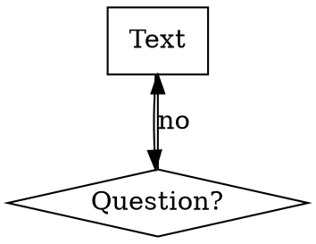

# Research: Claude Code Skills Format

## Current State of the Art

Claude Code skills are markdown files (`SKILL.md`) with YAML frontmatter that define reusable, auto-discoverable instructions for Claude. They live in `~/.claude/skills/<skill-name>/SKILL.md` (user-level) or within plugin directories.

## Format Specification

### YAML Frontmatter (Required)

```yaml
---
name: skill-name-with-hyphens
description: Use when [specific triggering conditions]
---
```

| Field | Constraints | Notes |
|-------|-------------|-------|
| `name` | Letters, numbers, hyphens only | Max 1024 chars total (name + description combined) |
| `description` | Must start with "Use when..." | Describe triggering conditions ONLY, never summarize the workflow |

**Critical: Claude Search Optimization (CSO)**
- Description describes WHEN to use (triggers, symptoms, situations)
- Never summarize what the skill does in the description
- This prevents Claude from reading the description and skipping the full skill content
- Include concrete triggers: error messages, command names, situations

### Markdown Body Structure

Standard section order:
1. `# Skill Name` (H1)
2. `## Overview` — 1-2 sentence core principle
3. `## When to Use` — bullet list of triggers, optional flowchart
4. `## The Process / The Pattern` — step-by-step with flowcharts
5. `## Quick Reference` — table format for scanning
6. `## Common Mistakes` — table of mistakes and fixes
7. Optional: Red Flags, Integration, Rationalizations, Verification Checklist

### Flowcharts

Use graphviz dot notation:


Use flowcharts for: non-obvious decisions, process loops, A-vs-B decisions.
Don't use for: reference material, linear instructions, simple code.

### Cross-References

```markdown
# Good — requires Claude to read the skill
**REQUIRED SUB-SKILL:** Use superpowers:test-driven-development

# Bad — force-loads entire file, wastes context
@superpowers:test-driven-development/SKILL.md
```

### Directory Structure

```
skills/
  skill-name/
    SKILL.md              # Required
    supporting-file.*     # Only if needed (100+ lines of reference)
```

Keep inline: principles, concepts, code patterns (<50 lines).
Separate files: heavy reference (100+ lines), reusable scripts/templates.

### Token Efficiency

| Skill Type | Target |
|-----------|--------|
| Getting-started workflows | < 150 words |
| Frequently-loaded skills | < 200 words |
| Other skills | < 500 words |

Compression: reference `--help`, cross-reference other skills, one excellent example over many mediocre ones.

## Skill Design Patterns

| Pattern | Use For | Key Elements |
|---------|---------|-------------|
| Discipline-Enforcing | TDD, debugging | Iron Law, Rationalizations table, Red Flags, loophole closure |
| Technique | How-to guides | Step-by-step, before/after, Quick Reference table |
| Pattern | Mental models | Core principle, recognition scenarios, counter-examples |
| Reference | Documentation | Tables, searchable content, common use case examples |

## Alternatives Evaluated

- **YAML-only config**: Less expressive, can't include process descriptions
- **JSON skill definitions**: Less readable, no inline documentation
- **Separate config + docs**: More complex, harder to maintain

**Recommendation:** The SKILL.md format with YAML frontmatter is well-designed. Use it as-is.

## Key Findings for Implementation

1. Skills are discovered by `name` and `description` frontmatter — CSO is critical
2. Keep descriptions trigger-focused, never summarize workflow
3. Use cross-references (`REQUIRED SUB-SKILL:`) not `@` force-loads
4. Token efficiency matters for frequently-loaded skills
5. Supporting files only when content exceeds ~100 lines

## Sources

- Superpowers plugin: `~/.claude/plugins/cache/claude-plugins-official/superpowers/4.3.1/`
- Writing Skills skill: `superpowers/skills/writing-skills/SKILL.md` (600+ lines, comprehensive format guide)
- Existing custom skills: `~/.claude/skills/clean-code-planner/`, `~/.claude/skills/python-coding-rules/`
