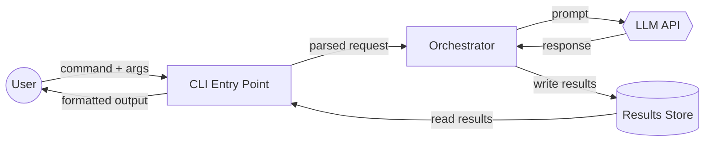
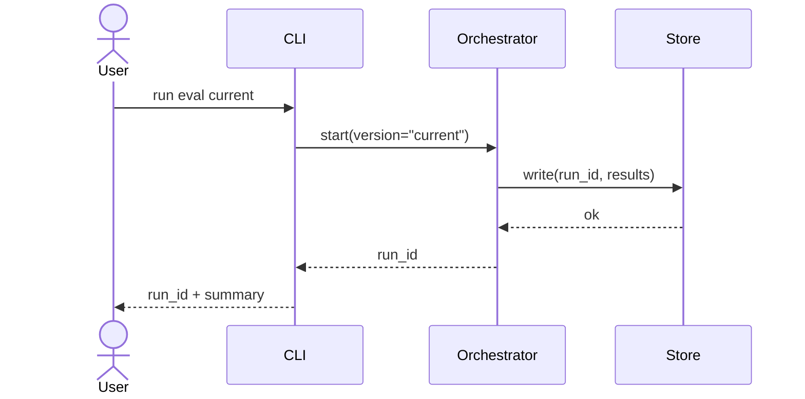

# Plan Arch

For a chosen approach (e.g. "Option C" from an `options.md`, a plan from `plan.md`, or a free-form description), produce a thorough architecture document that a human or implementation agent can read to understand how the system is structured, what each component does, how components interact, and how the user interacts with the system end-to-end.

The output is **architecture**, not implementation: named components with explicit **inputs / computation / outputs**, the data and control flows between them, and the user-facing flows they support. It is not a file-by-file code spec (see `/plan-codebase` for that) and not a tradeoff analysis (see `/plan-options` for that).

```
/plan-arch [approach description | path to options.md or plan.md | "option C from options.md"]
           [optional: user flows to document, e.g. "1) run eval current  2) run eval main  3) compare"]

  1. Understand the approach + target user flows
  2. Research the codebase context
  3. Identify system components
  4. Specify each component (inputs / computation / outputs)
  5. Map component interactions (data + control flow)
  6. Document user-system interaction flows
  7. Save to architecture.md
  8. Review loop
```

## Step 1: Understand the Approach and User Flows

Read the user's input. Resolve the approach description from whichever source is available:

- An explicit description in the user's message
- A referenced file (`options.md`, `plan.md`, a linked design doc) — read it in full
- A specific option within a file ("option C from options.md") — read the file, find that option, confirm scope

Extract and write down:

- **Approach:** the 1-3 sentence description of the chosen strategy
- **Goal:** what the system must accomplish
- **Constraints:** hard constraints the architecture must honor (backwards compat, perf budgets, API contracts, existing data models, deployment target)
- **User flows to document:** the specific end-to-end flows the user wants to understand. If the user lists them explicitly ("1) X 2) Y 3) Z"), use those verbatim. If not, derive the 2-5 most important flows from the approach description.

If the approach or the user flows are underspecified, **ask the user to clarify before proceeding**. Do NOT invent components based on assumptions. A wrong architecture document is worse than no architecture document.

## Step 2: Research the Codebase Context

Scan the codebase to ground the architecture in reality:

- Identify the language(s), framework(s), and runtime(s) in use
- Find existing modules, services, types, and interfaces the new architecture will touch or extend
- Locate entry points (CLI, HTTP handlers, skill dispatchers, etc.) the user flows will route through
- Note existing persistence, IPC, or message-passing mechanisms the architecture should reuse rather than duplicate
- Read CLAUDE.md and any architecture/design docs already in the repo

The goal is to know what's **already there** so new components fit the existing shape of the system. If the approach says "add a cache", find out if a cache utility already exists. If it says "a new agent", find out how other agents are dispatched.

For non-trivial codebases, dispatch an Explore subagent rather than doing all the searching inline.

## Step 3: Identify System Components

Decompose the approach into named components. A **component** is a unit that:

- Has a single clear responsibility
- Has a well-defined interface (what goes in, what comes out)
- Could plausibly be implemented and tested independently

Components can be: modules, services, CLIs, scripts, agents, skills, data stores, daemons, background jobs, UI surfaces, config files, or external integrations. Choose the granularity that makes the architecture legible — too coarse and the interactions are hand-wavy; too fine and the document drowns in boxes.

Aim for **3-10 components** for most designs. If you need more than 12, you're probably modeling at the wrong level of abstraction.

For each component, capture:

- **Name** — short, intention-revealing
- **Kind** — module / service / CLI / agent / skill / data store / external system / …
- **One-sentence purpose**

Write this as a flat list first. Don't dive into internals yet.

## Step 4: Specify Each Component (Inputs / Computation / Outputs)

For every component from Step 3, write a full specification:

```markdown
### Component: <name>

**Kind:** <module / service / agent / data store / …>

**Purpose:** <1-2 sentences — why this component exists>

**Inputs:**
| Source | Shape | Description |
|--------|-------|-------------|
| <who calls it / where data comes from> | <type or schema> | <what the input means> |

**Computation:**
<What this component does with its inputs, in plain English. 3-8 bullets or a short paragraph. Describe transformation logic, side effects, failure modes, and any non-obvious decisions the component makes. This is NOT pseudo-code — it is behavior description.>

**Outputs:**
| Destination | Shape | Description |
|-------------|-------|-------------|
| <who consumes it / where data goes> | <type or schema> | <what the output means> |

**State / Side effects:**
<Any files written, databases updated, external calls made, caches populated, events emitted. "Stateless" is a valid answer.>

**Dependencies:**
<Other components in this document it depends on, plus external libraries / services / APIs.>

**Failure modes:**
<What can go wrong and how the component signals it (exception, error result, retry, …). If nothing interesting, write "standard exceptions propagate".>
```

Guidelines:

- **Inputs and outputs must be concrete.** "A config" is not concrete; `ConfigV2 dataclass with fields {name, model, max_tokens}` is.
- **Name the shape.** If a real type already exists (`PullRequest`, `ReviewResult`), use it. Otherwise invent a name and define it in a Data Models section (Step 5).
- **Describe behavior, not implementation.** "Computes embedding using SentenceTransformer and writes to vector store" is architecture. `for chunk in text.split('\n')` is not.
- **If a component uses an LLM, say which model and what the prompt contract is** (inputs to the prompt, expected output shape).

## Step 5: Map Component Interactions

Describe how the components fit together. Produce **both** a diagram and a written description — each catches things the other misses.

### 5a. Component Diagram

Use a Mermaid `flowchart` or `graph` diagram showing components as nodes and data/control flow as labeled edges:

```markdown

```

Label every edge with **what flows across it**, not just that there is an arrow. Use shape conventions: rectangles for processes, cylinders for stores, diamonds/hex for external systems, circles for users.

If the system has distinct layers (e.g. presentation / orchestration / data), group components with `subgraph` blocks.

### 5b. Data Models

For every non-trivial shape that crosses a component boundary, define it once here so components can reference it by name:

```markdown
### Data Model: <TypeName>

<1-sentence purpose>

| Field | Type | Required | Description |
|-------|------|----------|-------------|
| id | string | yes | Stable identifier |
| created_at | timestamp | yes | When this was produced |
| payload | Payload | yes | The thing |
```

### 5c. Interaction Notes

Written notes for interactions that the diagram can't capture cleanly:

- **Synchronous vs asynchronous** — which calls block, which are fire-and-forget
- **Error propagation** — how failures in one component reach another
- **Concurrency** — what runs in parallel vs serially
- **Idempotency** — which operations can be retried safely
- **Backpressure / rate limits** — anywhere one component can overwhelm another

## Step 6: Document User-System Interaction Flows

For **every** user flow from Step 1, write a step-by-step interaction. Use the flows the user named verbatim — if they said "1) run eval on current version 2) run eval on main version 3) compare evals", produce exactly those three flows.

For each flow:

```markdown
### User Flow: <name>

**Trigger:** <what the user does to start this flow>

**Preconditions:** <what must be true for this flow to work — existing files, credentials, prior flows completed, …>

**Steps:**
1. User runs `<command or action>` with `<inputs>`.
2. **<ComponentA>** receives the request, does <X>, and produces <Y>.
3. **<ComponentA>** calls **<ComponentB>** with <Y>.
4. **<ComponentB>** does <Z> and writes <result> to **<Store>**.
5. **<ComponentA>** reads <result> from **<Store>**, formats it, and returns it to the user.

**Outputs to user:** <what the user sees — stdout, a file, a URL, a status, …>

**Failure modes from the user's perspective:** <what can go wrong and what the user sees when it does>
```

Every step must name a specific component from Step 3. If a step can't be attributed to a named component, either the component list is incomplete or the step is happening magically — fix one or the other.

Also include a **sequence diagram** per flow when it makes the ordering clearer:

```markdown

```

## Step 7: Save to File

Write the full architecture to `architecture.md` at the repository root:

```bash
REPO_ROOT=$(git rev-parse --show-toplevel)
```

Use this document structure:

```markdown
# Architecture: <approach name>

**Source:** <path to options.md / plan.md / "user-provided description">
**Date:** <ISO-8601>
**Status:** draft

## 1. Summary

<3-5 sentence overview: what the system does, the chosen approach, and the key architectural moves.>

## 2. Goals and Constraints

- **Goals:** …
- **Non-goals:** …
- **Constraints:** …

## 3. Components

<Full spec from Step 4 for each component.>

## 4. Component Interactions

### 4.1 Component Diagram
<Mermaid diagram from Step 5a.>

### 4.2 Data Models
<Data models from Step 5b.>

### 4.3 Interaction Notes
<Notes from Step 5c.>

## 5. User-System Interaction Flows

<Every flow from Step 6, with sequence diagrams.>

## 6. Open Questions and Risks

| Item | Description | Impact | Recommendation |
|------|-------------|--------|----------------|
| 1 | <unresolved question> | <what breaks if we guess wrong> | <how to resolve> |

## 7. Out of Scope

<Explicit list of things this architecture does NOT cover, to head off scope creep.>
```

If `architecture.md` already exists, read it first. If it describes the same approach, update in place. If it describes a different approach, append with a horizontal rule and a new `# Architecture: …` heading.

**After saving, always print:**

```
Architecture saved to: /absolute/path/to/architecture.md

Components: <N>
User flows documented: <M>
Open questions flagged: <K>

Review the document and tell me which parts need more depth or correction.
```

Do NOT proceed to implementation. The architecture is the deliverable.

## Step 8: Architecture Review Loop

After saving `architecture.md`, dispatch a **review agent** to critique it. Iterate until the reviewer approves or 3 iterations have run.

### Review Agent Instructions

Dispatch a subagent (via the Agent tool) with this prompt:

> You are an architecture reviewer. Read `architecture.md` and the referenced source files and codebase. Evaluate against these criteria:
>
> 1. **Factual accuracy** — Every claim about the existing codebase (file paths, module names, type names, framework choices, existing utilities) must be verified against the actual code. Flag anything that doesn't match reality.
> 2. **Component completeness** — Does every user flow route through named components? Is any step in a flow unattributed or hand-waved? Is any component missing inputs, outputs, or a purpose?
> 3. **Interface precision** — Are inputs and outputs described concretely (types, shapes, schemas), or vaguely ("a config", "some data")?
> 4. **Interaction correctness** — Does the component diagram match the written flows? Are there edges in the diagram that aren't used by any flow, or flow steps that aren't in the diagram?
> 5. **User flow coverage** — Are all flows the user asked about documented? Are preconditions, outputs, and failure modes present for each?
> 6. **Granularity** — Are components at a consistent level of abstraction? (Don't mix "the whole frontend" with "the parseArgs function" as peer components.)
> 7. **Risks and open questions** — Are genuinely uncertain parts flagged, or are open questions glossed over?
>
> **IMPORTANT:** For each factual claim about the codebase, verify it by reading the actual code. Do not take claims at face value.
>
> Output one of:
> - **APPROVED** — architecture is accurate, complete, and precise
> - **FEEDBACK** — list each issue with: section, problem, suggested fix
>
> Be strict on factual accuracy and interface precision. Be practical on granularity and style.

### Review Loop

```
1. Save architecture.md (Step 7)
2. Dispatch review agent
3. If APPROVED → done, print final summary
4. If FEEDBACK:
   a. Address each issue by updating architecture.md
   b. Re-dispatch the review agent
   c. Repeat (max 3 iterations)
5. If feedback remains after 3 iterations → append remaining feedback as a "Known issues" section and print it as a warning
```

**After the loop completes, always print:**

```
Architecture reviewed and saved to: /absolute/path/to/architecture.md
```

## Quick Reference

| Step | Action | Output |
|------|--------|--------|
| 1 | Understand approach + user flows | Scoped goal, constraints, flow list |
| 2 | Research codebase | Reuse map, existing patterns |
| 3 | Identify components | Flat named list |
| 4 | Specify components | I/O + computation per component |
| 5 | Map interactions | Diagram + data models + notes |
| 6 | Document user flows | Step-by-step per flow + sequence diagrams |
| 7 | Save to file | `architecture.md` at repo root |
| 8 | Review loop | Verified architecture.md |

## Common Mistakes

| Mistake | Fix |
|---------|-----|
| Jumping straight to components without understanding user flows | User flows drive which components are needed — do Step 1 first |
| Components described only by name ("Orchestrator: orchestrates things") | Every component must have concrete inputs, computation, and outputs |
| Vague interfaces ("takes a config, returns a result") | Name the shape — use real types or define them in Data Models |
| Writing pseudo-code instead of behavior | This is architecture, not implementation. Describe what, not how |
| Diagram and user flows disagree | They must be consistent — the diagram is the structure, flows are paths through it |
| User flow steps that don't name a component | Every step must route through a named component from the list |
| Mixing granularity levels | All peer components should be at similar abstraction — don't put "the CLI" next to "parseArgs()" |
| Inventing components not grounded in the codebase | Research the repo first; name existing components and conventions |
| Skipping the review loop | ALWAYS run the reviewer — it catches drift between the architecture and the actual code |
| Proceeding to implementation | STOP after the review loop — `/plan-codebase` or `/implement-orchestrator` takes it from here |
| Treating this as an alias for `/plan-options` or `/plan-codebase` | Options = compare approaches. Codebase = file-by-file spec. Arch = components + I/O + interactions + user flows |
